# TP842N v3 OpenWrt 21.02 打印服务器固件

## 🎯 版本信息

- **OpenWrt版本**: 21.02 LTS (长期支持版)
- **设备型号**: TP-Link TL-WR842N v3
- **架构**: ath79/generic (从ar71xx迁移)
- **内核**: Linux 5.4.x
- **CUPS版本**: 2.4.2
- **固件大小**: < 16MB

## 📋 重要变更说明

### 从ar71xx到ath79的迁移

OpenWrt 21.02版本中，TP842N v3的架构从`ar71xx`迁移到了`ath79`：

| 项目 | 旧版本(ar71xx) | 新版本(ath79) |
|------|---------------|--------------|
| **目标架构** | `CONFIG_TARGET_ar71xx=y` | `CONFIG_TARGET_ath79=y` |
| **设备名称** | `tl-wr842n-v3` | `tplink_tl-wr842n-v3` |
| **WiFi路径** | `platform/qca953x_wmac` | `platform/ahb/18100000.wmac` |
| **内核** | Linux 4.14 | Linux 5.4 |
| **维护状态** | 已废弃 | 活跃维护 |

### 固件分区调整

```
┌──────────────────────────────────┐
│  Bootloader (u-boot)             │ 128KB
├──────────────────────────────────┤
│  Kernel                          │ 2MB (2048KB)
├──────────────────────────────────┤
│  Root Filesystem (SquashFS)      │ 13.6MB (13952KB)
├──────────────────────────────────┤
│  Overlay (配置保存区)             │ 动态
└──────────────────────────────────┘
Total: 16MB
```

## 🔧 技术栈

### 核心组件

| 组件 | 版本 | 说明 |
|------|------|------|
| **OpenWrt** | 21.02.x | LTS长期支持版 |
| **LuCI** | 21.02 | Web管理界面 |
| **CUPS** | 2.4.2 | 打印服务器 |
| **Ghostscript** | 9.53.x | PostScript/PDF渲染 |
| **HPLIP** | 3.21.x | HP打印机驱动 |
| **P910nd** | 0.97 | 原始网络打印 |
| **Samba** | 4.13.x | 文件共享服务 |

### 无线驱动

```bash
# ath79平台使用ath9k驱动
- kmod-ath9k          # Atheros 802.11n驱动
- kmod-ath9k-common   # 公共库
- wpad-basic-wolfssl  # WPA/WPA2认证
```

## 📦 预装软件包清单

### 打印服务相关
```
✅ cups                    # CUPS核心
✅ cups-client             # CUPS客户端工具
✅ cups-bsd               # BSD打印命令
✅ cups-filters           # 打印过滤器
✅ cups-ppdc              # PPD编译器
✅ libcups                # CUPS库
✅ ghostscript            # PS/PDF渲染引擎
✅ ghostscript-fonts-std  # 标准字体
✅ hplip-common           # HP驱动核心
✅ hplip-sane             # HP扫描支持
✅ foomatic-db            # 打印机数据库
✅ foomatic-db-engine     # Foomatic引擎
✅ foomatic-filters       # Foomatic过滤器
✅ p910nd                 # 网络打印守护进程
✅ luci-app-p910nd        # P910nd Web界面
```

### 系统工具
```
✅ luci-app-autoreboot    # 定时重启
✅ luci-app-samba4        # Samba共享
✅ htop                   # 系统监控
✅ iperf3                 # 网络测试
✅ tcpdump                # 数据包分析
✅ curl/wget              # 下载工具
```

### 语言支持
```
✅ luci-i18n-base-zh-cn
✅ luci-i18n-p910nd-zh-cn
✅ luci-i18n-samba4-zh-cn
✅ fonts-chinese          # 中文字体
```

## 🚀 编译说明

### GitHub Actions自动编译

1. **推送代码触发编译**
```bash
git add .
git commit -m "update config"
git push
```

2. **手动触发编译**
- 访问仓库 → Actions
- 选择 "编译TP842N-v3打印服务器固件"
- 点击 "Run workflow"

### 编译时间估算

| 阶段 | 时间 | 说明 |
|------|------|------|
| 环境初始化 | 5分钟 | 安装编译依赖 |
| 克隆源码 | 3-5分钟 | 下载OpenWrt源码 |
| 更新feeds | 5-10分钟 | 下载软件包源 |
| 下载依赖 | 10-20分钟 | 下载编译依赖 |
| 编译固件 | 45-60分钟 | 核心编译阶段 |
| **总计** | **70-100分钟** | 首次编译 |

### 本地编译

```bash
# 1. 安装依赖（Ubuntu 20.04/22.04）
sudo apt update
sudo apt install -y build-essential clang flex bison g++ gawk \
gcc-multilib g++-multilib gettext git libncurses5-dev libssl-dev \
python3-distutils rsync unzip zlib1g-dev file wget

# 2. 克隆OpenWrt源码
git clone https://git.openwrt.org/openwrt/openwrt.git -b openwrt-21.02
cd openwrt

# 3. 复制配置
cp /path/to/.config .config
cp -r /path/to/files ./files

# 4. 更新feeds
./scripts/feeds update -a
./scripts/feeds install -a

# 5. 配置（可选）
make menuconfig

# 6. 下载依赖
make download -j8

# 7. 编译
make -j$(nproc) || make -j1 V=s

# 8. 固件位置
ls bin/targets/ath79/generic/
```

## 📥 固件安装

### 首次刷入（从原厂固件）

1. 下载固件文件：
   - `openwrt-21.02.x-ath79-generic-tplink_tl-wr842n-v3-squashfs-factory.bin`

2. 进入原厂Web界面：
   - http://192.168.0.1
   - 系统工具 → 软件升级

3. 上传factory固件并等待重启

4. 新IP地址：http://192.168.10.1

### 升级固件（从OpenWrt升级）

1. 下载固件文件：
   - `openwrt-21.02.x-ath79-generic-tplink_tl-wr842n-v3-squashfs-sysupgrade.bin`

2. 进入OpenWrt管理界面：
   - http://192.168.10.1
   - 系统 → 备份/升级

3. 上传sysupgrade固件

4. 选择是否保留配置

5. 刷写固件

## 🖨️ CUPS配置

### Web界面访问

```
管理界面: http://192.168.10.1:631
语言: 简体中文
用户名: root
密码: thdn12345678
```

### 支持的HP打印机型号

| 型号 | USB PID | 状态 |
|------|---------|------|
| HP LaserJet 1020 | 3f0:2b17 | ✅ 完全支持 |
| HP LaserJet 1020plus | 3f0:3d17 | ✅ 完全支持 |
| HP LaserJet 1018 | 3f0:1017 | ✅ 完全支持 |
| HP LaserJet 1007 | 3f0:5811 | ✅ 完全支持 |
| HP LaserJet 1008 | 3f0:5c11 | ✅ 完全支持 |
| HP LaserJet 1108 | 3f0:4817 | ✅ 完全支持 |

### 打印机自动配置流程

```mermaid
graph LR
A[插入USB] --> B[热插拔检测]
B --> C[启动CUPS]
C --> D[检测设备]
D --> E[自动添加打印机]
E --> F[设为默认]
F --> G[就绪]
```



### 手动添加打印机

```bash
# SSH登录路由器
ssh root@192.168.10.1

# 查看可用打印机
lpinfo -v

# 添加打印机
lpadmin -p HP-LaserJet -E -v usb://HP/LaserJet%201020 -m everywhere

# 设为默认
lpadmin -d HP-LaserJet

# 查看状态
lpstat -t
```

## 🌐 网络打印配置

### Windows客户端

#### 方法一：通过IPP

1. 控制面板 → 设备和打印机 → 添加打印机
2. 选择"我需要的打印机不在列表中"
3. 选择"通过TCP/IP地址或主机名添加打印机"
4. 主机名：`192.168.10.1`
5. 端口类型：自动检测
6. 打印机URL：`http://192.168.10.1:631/printers/HP-LaserJet`

#### 方法二：通过P910nd（9100端口）

1. 添加打印机 → 本地打印机
2. 创建新端口 → Standard TCP/IP Port
3. IP地址：`192.168.10.1`
4. 端口：`9100`
5. 选择HP打印机驱动

### macOS客户端

```bash
# 系统偏好设置 → 打印机与扫描仪 → +
协议: IPP
地址: 192.168.10.1
队列: printers/HP-LaserJet
名称: HP LaserJet
驱动: 选择HP LaserJet 1020
```

### Linux客户端

```bash
# 方法一：CUPS Web界面
firefox http://localhost:631

# 方法二：命令行
lpadmin -p HP-Remote \
  -E \
  -v ipp://192.168.10.1:631/printers/HP-LaserJet \
  -m everywhere

# 测试打印
echo "Test Page" | lp -d HP-Remote
```

### Android/iOS客户端

- **Android**: 安装"Mopria Print Service"
- **iOS**: 原生支持AirPrint（需配置）

## ⚙️ 高级配置

### 定时重启

```bash
# Web界面：系统 → 计划任务 → 定时重启
# 默认：每天凌晨4点重启

# 命令行配置
uci set autoreboot.@login[0].minute='0'
uci set autoreboot.@login[0].hour='4'
uci set autoreboot.@login[0].week='*'
uci set autoreboot.@login[0].enable='1'
uci commit autoreboot
```

### WiFi参数调优

```bash
# 提高无线性能
uci set wireless.radio0.txpower='20'        # 发射功率
uci set wireless.radio0.channel='6'         # 信道
uci set wireless.radio0.htmode='HT20'       # 20MHz带宽
uci set wireless.radio0.legacy_rates='1'    # 启用旧速率
uci commit wireless
wifi reload
```

### CUPS性能优化

编辑 `/etc/cups/cupsd.conf`:

```apache
# 日志级别（生产环境使用warn）
LogLevel warn

# 限制作业大小（单位：KB）
MaxJobSize 10240

# 保留作业历史
PreserveJobHistory Off
PreserveJobFiles Off

# 并发打印任务
MaxJobs 10
MaxJobsPerPrinter 5
```

### Samba共享打印机

```bash
# 启用Samba
uci set samba4.@samba[0].name='THDN-PrintServer'
uci set samba4.@samba[0].workgroup='WORKGROUP'
uci commit samba4

# 重启服务
/etc/init.d/samba4 restart
```

## 🔍 故障排除

### 打印机未识别

```bash
# 1. 检查USB设备
lsusb | grep -i hp

# 2. 查看内核日志
dmesg | tail -20

# 3. 检查USB模块
lsmod | grep usb

# 4. 重新加载USB打印机模块
rmmod usblp
modprobe usblp
```

### CUPS服务问题

```bash
# 检查CUPS状态
/etc/init.d/cupsd status

# 重启CUPS
/etc/init.d/cupsd restart

# 查看CUPS日志
tail -f /var/log/cups/error_log

# 测试CUPS端口
netstat -tuln | grep 631
```

### 网络打印失败

```bash
# 检查防火墙
iptables -L -n | grep 631

# 手动开放端口
iptables -I INPUT -p tcp --dport 631 -j ACCEPT

# 永久保存
/etc/init.d/firewall reload
```

### WiFi连接问题

```bash
# 检查无线状态
wifi status

# 重启无线
wifi reload

# 查看无线日志
logread | grep wifi
```

## 📊 性能指标

### 系统资源占用

| 项目 | 空闲 | 打印中 |
|------|------|--------|
| **内存使用** | 35-45MB | 60-80MB |
| **CPU使用** | 5-10% | 40-60% |
| **存储空间** | 12-14MB | - |

### 打印速度

| 文档类型 | 处理时间 | 说明 |
|---------|---------|------|
| 纯文本 | 1-2秒 | 最快 |
| PDF文档 | 3-5秒 | 需渲染 |
| 图片 | 5-10秒 | 取决于大小 |
| 复杂页面 | 10-20秒 | 高CPU占用 |

## 🛡️ 安全建议

### 1. 修改默认密码

```bash
passwd root
```

### 2. 禁用WAN访问

```bash
uci add firewall rule
uci set firewall.@rule[-1].name='Block-CUPS-WAN'
uci set firewall.@rule[-1].src='wan'
uci set firewall.@rule[-1].dest_port='631'
uci set firewall.@rule[-1].proto='tcp'
uci set firewall.@rule[-1].target='REJECT'
uci commit firewall
/etc/init.d/firewall reload
```

### 3. 限制SSH访问

```bash
uci set dropbear.@dropbear[0].Port='22'
uci set dropbear.@dropbear[0].Interface='lan'
uci set dropbear.@dropbear[0].PasswordAuth='on'
uci set dropbear.@dropbear[0].RootPasswordAuth='on'
uci commit dropbear
/etc/init.d/dropbear restart
```

## 📚 参考资料

- [OpenWrt 21.02文档](https://openwrt.org/docs/guide-user/start)
- [CUPS官方文档](https://www.cups.org/documentation.html)
- [ath79平台迁移指南](https://openwrt.org/docs/guide-user/installation/ar71xx.to.ath79)
- [TP842N v3设备页面](https://openwrt.org/toh/tp-link/tl-wr842nd)

## 📝 更新日志

### v1.0 (2025-01-28)
- ✅ 基于OpenWrt 21.02 LTS
- ✅ 迁移到ath79架构
- ✅ 集成CUPS 2.4.2
- ✅ 预装HP LaserJet驱动
- ✅ 中文界面完整支持
- ✅ 自动USB热插拔配置
- ✅ 网络打印支持
- ✅ 定时重启功能

---

**编译时间**: 自动生成  
**OpenWrt版本**: 21.02 LTS  
**维护**: https://github.com/lh85558/842nv3
